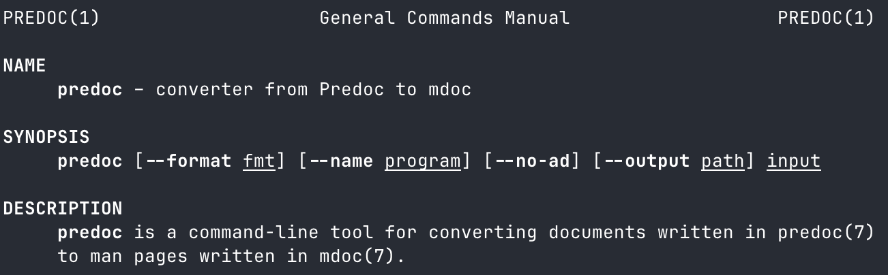

# Predoc

Predoc is both a Markdown flavour specifically designed for writing manpages
and a command-line tool for converting a Predoc document into a manpage written
in mdoc.

> [!WARNING]
> Predoc is in an alpha stage of development. There are likely to be bugs and
> gaps in its implementation.

## Example

The `predoc` tool takes this:

```md
---
Title: PREDOC(1)
Authors: Michael Camilleri <mike@inqk.net>
Date: August 9, 2025
---

NAME
====

**predoc** - converter from Predoc to mdoc

SYNOPSIS
========

**predoc** [**--output** _path_] _program_ [_input_]

DESCRIPTION
===========

**predoc** is a command-line tool for converting documents written in Predoc to
manpages written in mdoc.
```

and converts it to this:

```mdoc
.Dd August 9, 2025
.Dt PREDOC 1
.
.Sh NAME
.Nm predoc
.Nd converter from Predoc to mdoc
.
.Sh SYNOPSIS
.Nm
.Op Fl -output Ar path
.Ar program
.Op Ar input
.
.Sh DESCRIPTION
.Nm
is a command-line tool for converting documents written in Predoc to manpages written in mdoc.
```

which in turn is rendered by `man` into this:



## Installation

Clone the repository into `./predoc` and run `janet --install predoc`.

## Usage

To convert a manpage for the program `example` from Predoc to mdoc:

```
$ predoc --output example.1 example example.1.predoc
```

## Bugs

Found a bug? I'd love to know about it. The best way is to report your bug in
the [Issues][] section on GitHub.

[Issues]: https://github.com/pyrmont/predoc/issues

## Licence

Predoc is licensed under the MIT Licence. See [LICENSE][] for more details.

[LICENSE]: https://github.com/pyrmont/predoc/blob/master/LICENSE
